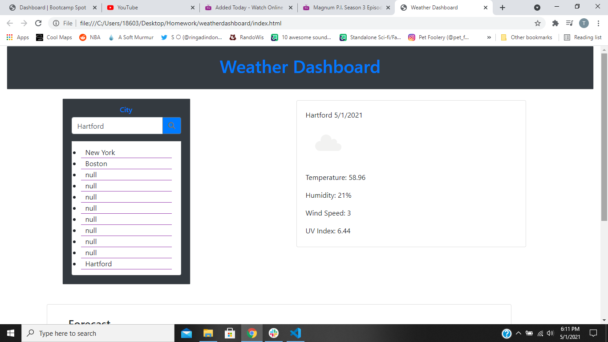
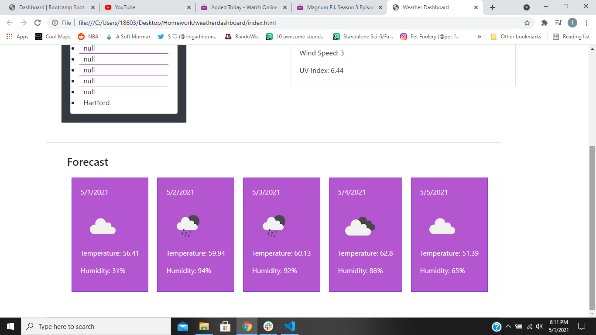

# Weather Dashboard
Program that allows weather forecast for multiple location

https://pratikpatel-code.github.io/weatherdashboard/

#
## Project Overview:

#
## Project Goals:
1. Weather projection using API that forcest 5 day weather for any given city
2. Stores multiple cities in case you are doing a road trip.
3. Will give cities UV, and Wind using the api links posted in the web api site.  

#

#

## Conributers
[Pratik Patel](https://github.com/PratikPatel-Code/)

#
## Built With:
[Visual Studio](https://visualstudio.microsoft.com/)

[CSS](https://www.w3.org/TR/CSS/#css)

[JavaScript](https://www.javascript.com/)

#
## Links:
[Email](pratikpatel_85@yahoo.com)

[Github Profile](https://github.com/PratikPatel-Code/)

[Weather Dashboard](https://pratikpatel-code.github.io/weatherdashboard/)